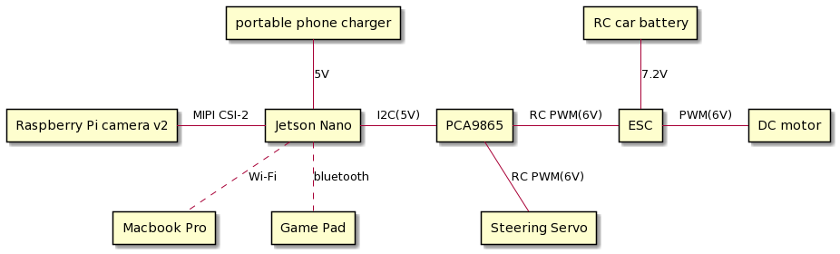

# LunchJet
[Jetson Nano](https://developer.nvidia.com/embedded/jetson-nano-developer-kit) as a RC controller on [Lunch Box](https://www.tamiya.com/english/products/58347lunchbox/index.htm), which is a RC car made by Tamiya


# system components



# prerequisite

[v2l4loopback](https://github.com/umlaeute/v4l2loopback) is needed to run the LunchJet.
```bash
$ git clone https://github.com/umlaeute/v4l2loopback
$ cd v4l2loopback
$ make && sudo make install
```

# build and install

```bash
$ mkdir build && cd build
build$ cmake .. && make VERBOSE=1 -j4 && sudo make install
```